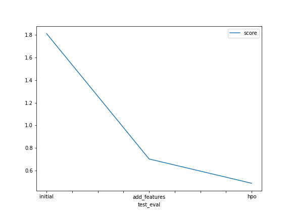

# Report: Predict Bike Sharing Demand with AutoGluon Solution
#### NAME :Mohamed Samy Mohamed Mansour

## Initial Training
### What did you realize when you tried to submit your predictions? What changes were needed to the output of the predictor to submit your results?
TODO: Add your explanation
I realize that first i must have an account and acept to licence of this competitions and then create a submission file that include first datetime and second prediction values and must make index = False 

### What was the top ranked model that performed?
TODO: Add your explanation
the top ranked model in case three which we add more features and make hyperparamter tuning .

## Exploratory data analysis and feature creation
### What did the exploratory analysis find and how did you add additional features?
TODO: Add your explanation
most of days have a high humdity and most of temp between 15 and 25 and .
most ot hours that bike used in this hours 0 to 2 , 8 to 10 ,13 to 15 and 21 to 24 , we can do more analysis to know why this hours is busy insted of others .
most of monthes are busy are jan , fab , nov and dec.
it may be 4 contuinous monthes are busy from other monthes in the year .
most of days count will less than other days it skewed to right.

### How much better did your model preform after adding additional features and why do you think that is?
TODO: Add your explanation
the accuracy of model increased beacuse datetime columns itself not helpful as we split it into month , days,hours , year because this information we split give us more insight because as we know hour have a influence in bike sharing and also days weekdays not such weekend and so on and also monthes the monthes have a clelebration or any organization or study monthes will reflect on bike sharing demand so it will give model more insight to do better and understand data and generlize weel on the future data .
## Hyper parameter tuning
### How much better did your model preform after trying different hyper parameters?
TODO: Add your explanation
the accuracy incresed because it give model more opprtunity to customize model  more on different space may be increse model perfoemance .

### If you were given more time with this dataset, where do you think you would spend more time?
TODO: Add your explanation
i will spend more time in EDA to understand data more and also make data analysis to extract more insights from data 
and also make feature engineering process such adding useful feature  or make feature selection or some transformation to numerical feature or categorical and also in tuning hyperparamters 

### Create a table with the models you ran, the hyperparameters modified, and the kaggle score.
|model|max-based-models|max-based-models-per-type|use-org-features|score|
|--|--|--|--|--|
|initial|25|5|True|1.80966|
|add_features|25|5|True|0.0354|
|hpo|25|5|False|048922|

### Create a line plot showing the top model score for the three (or more) training runs during the project.

TODO: Replace the image below with your own.

## Summary
TODO: Add your explanation
After all that we can give some points 
1-EDA is important thing to do if you want to make a better understanding of data .
2-Feature Engineering if it used well we can increse performance well .
3-Tuning hyperparamters will have a good affect if data cleaned and features are informative .